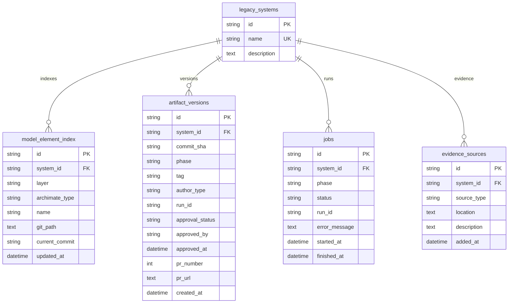

# MVP Database Schema

The MVP keeps full model artifacts in the GitHub model repository. The database stores system metadata, indexes, job status, evidence source references, and artifact approval state.

